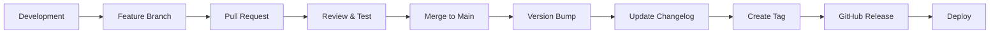

# Release Management Guide

## Overview

This guide covers the complete release process for PinkSync, including versioning, changelog management, and deployment.

## 📋 Table of Contents

- [Versioning Strategy](#versioning-strategy)
- [Release Process](#release-process)
- [Changelog Management](#changelog-management)
- [Branch Strategy](#branch-strategy)
- [Automated Releases](#automated-releases)
- [Manual Releases](#manual-releases)
- [Rollback Procedures](#rollback-procedures)

---

## Versioning Strategy

### Semantic Versioning

PinkSync follows [Semantic Versioning 2.0.0](https://semver.org/):

```
MAJOR.MINOR.PATCH[-PRERELEASE][+BUILD]

Example: 1.2.3-beta.1+20251215
```

**Version Components:**
- **MAJOR** (1.x.x) - Breaking changes
- **MINOR** (x.2.x) - New features (backwards compatible)
- **PATCH** (x.x.3) - Bug fixes (backwards compatible)
- **PRERELEASE** - alpha, beta, rc (release candidate)
- **BUILD** - Build metadata (date, commit hash)

### Version Incrementation Rules

| Change Type | Version | Example |
|-------------|---------|---------|
| Breaking API change | MAJOR | 1.0.0 → 2.0.0 |
| New feature | MINOR | 1.0.0 → 1.1.0 |
| Bug fix | PATCH | 1.0.0 → 1.0.1 |
| Pre-release | PRERELEASE | 1.0.0 → 1.1.0-beta.1 |

### Branch-Specific Versioning

Each branch can have its own version:

```json
// Main platform (package.json)
{
  "version": "1.0.0"
}

// Service branch (services/deafauth/package.json)
{
  "version": "2.3.1"
}

// Feature branch (pre-release)
{
  "version": "1.1.0-feat-video-filters.1"
}
```

---

## Release Process

### Standard Release Flow



### Step-by-Step Process

#### 1. Prepare for Release

```bash
# Ensure you're on main branch
git checkout main
git pull origin main

# Check status
git status

# Review pending changes
git log --oneline --since="1 month ago"
```

#### 2. Update Version

```bash
# Use npm version command (automatically commits and tags)
npm version minor -m "chore: release v%s"

# Or manually update package.json
# Then commit:
git add package.json
git commit -m "chore: bump version to 1.1.0"
```

#### 3. Update Changelog

Edit `CHANGELOG.md`:

```markdown
## [1.1.0] - 2025-12-15

### Added
- Branch deployment system
- Interactive deployment helper

### Fixed
- Banner formatting in scripts

[1.1.0]: https://github.com/pinkycollie/PinkSync/compare/v1.0.0...v1.1.0
```

```bash
git add CHANGELOG.md
git commit -m "docs: update changelog for v1.1.0"
```

#### 4. Create Git Tag

```bash
# Create annotated tag
git tag -a v1.1.0 -m "Release v1.1.0

## Highlights
- Branch-specific GitHub Pages deployments
- Interactive deployment helper
- Comprehensive documentation

See CHANGELOG.md for details."

# Push tag
git push origin v1.1.0
```

#### 5. Create GitHub Release

```bash
# Using GitHub CLI
gh release create v1.1.0 \
  --title "PinkSync v1.1.0 - Branch Deployments" \
  --notes-file release-notes.md \
  --latest

# Or use the web interface at:
# https://github.com/pinkycollie/PinkSync/releases/new
```

#### 6. Deploy Release

```bash
# Production deployment
npm run deploy:production

# Or trigger via GitHub Actions
gh workflow run deploy.yml --ref v1.1.0
```

---

## Changelog Management

### Daily Development

As you work, add entries to `CHANGELOG.md` under `[Unreleased]`:

```markdown
## [Unreleased]

### Added
- New video transcription service
- Support for JSL (Japanese Sign Language)

### Changed
- Improved RAG engine performance by 40%

### Fixed
- DeafAuth token expiration issue
```

### Release Time

When creating a release, move unreleased changes:

```markdown
## [1.2.0] - 2025-12-20

### Added
- New video transcription service
- Support for JSL (Japanese Sign Language)

### Changed
- Improved RAG engine performance by 40%

### Fixed
- DeafAuth token expiration issue

## [1.1.0] - 2025-12-15
...
```

### Changelog Categories

Use these standard categories:

- **Added** - New features
- **Changed** - Changes to existing functionality
- **Deprecated** - Soon-to-be removed features
- **Removed** - Removed features
- **Fixed** - Bug fixes
- **Security** - Security updates

### Automated Changelog Generation

Use the provided script:

```bash
# Generate changelog from commits
npm run changelog:generate

# Preview changes
npm run changelog:preview
```

---

## Branch Strategy

### Main Branches

```
main (stable, production-ready)
├── staging (pre-production testing)
├── develop (integration branch)
```

### Feature Branches

```
feature/video-filters
service/deafauth-v2
api/booking-system
tool/qr-scanner
```

### Release Branches

```
release/1.1.0
release/2.0.0-beta
```

### Hotfix Branches

```
hotfix/security-patch
hotfix/critical-bug
```

### Branch Deployment Versions

Each deployed branch includes version in metadata:

```
main → v1.1.0
staging → v1.1.0-staging.1
feature/xyz → v1.2.0-feat-xyz.1
service/abc → v2.0.0 (independent)
```

---

## Automated Releases

### GitHub Actions Workflow

Create `.github/workflows/release.yml`:

```yaml
name: Create Release

on:
  push:
    tags:
      - 'v*'

jobs:
  release:
    runs-on: ubuntu-latest
    steps:
      - uses: actions/checkout@v4
        with:
          fetch-depth: 0

      - name: Generate Release Notes
        run: |
          # Extract changelog for this version
          node scripts/extract-changelog.js ${{ github.ref_name }}

      - name: Create GitHub Release
        uses: actions/create-release@v1
        env:
          GITHUB_TOKEN: ${{ secrets.GITHUB_TOKEN }}
        with:
          tag_name: ${{ github.ref_name }}
          release_name: PinkSync ${{ github.ref_name }}
          body_path: release-notes.md
          draft: false
          prerelease: false

      - name: Deploy to Production
        run: npm run deploy:production
```

### Automatic Version Bump

Use semantic-release or standard-version:

```bash
# Install standard-version
npm install --save-dev standard-version

# Add scripts to package.json
{
  "scripts": {
    "release": "standard-version",
    "release:minor": "standard-version --release-as minor",
    "release:major": "standard-version --release-as major",
    "release:patch": "standard-version --release-as patch"
  }
}

# Run release
npm run release
```

---

## Manual Releases

### Quick Release Process

```bash
# Use the release script
npm run release:create

# Follow prompts:
# 1. Select version type (major/minor/patch)
# 2. Enter release notes
# 3. Confirm changelog
# 4. Push to GitHub
```

### Manual Steps

```bash
# 1. Version bump
npm version minor

# 2. Update changelog
vim CHANGELOG.md

# 3. Commit changes
git add .
git commit -m "chore: release v1.1.0"

# 4. Create tag
git tag -a v1.1.0 -m "Release v1.1.0"

# 5. Push
git push origin main --tags

# 6. Create GitHub release
gh release create v1.1.0 --generate-notes
```

---

## Rollback Procedures

### Rollback a Release

```bash
# 1. Revert to previous version
git checkout v1.0.0

# 2. Create hotfix branch
git checkout -b hotfix/rollback-v1.1.0

# 3. Deploy previous version
npm run deploy:production

# 4. Update changelog
echo "## [1.0.1] - $(date +%Y-%m-%d)

### Fixed
- Rolled back v1.1.0 due to critical issue
- Applied hotfix for XYZ
" >> CHANGELOG.md

# 5. Create new patch release
git tag -a v1.0.1 -m "Hotfix: rollback v1.1.0"
git push origin v1.0.1
```

### Emergency Rollback

```bash
# Quick rollback via GitHub Actions
gh workflow run rollback.yml --field version=v1.0.0

# Or manually
git revert <commit-hash>
git push origin main
```

---

## Service-Specific Versioning

### Individual Service Releases

Each microservice can be versioned independently:

```bash
# Release DeafAuth service
cd services/deafauth
npm version minor
git tag -a deafauth-v2.1.0 -m "DeafAuth v2.1.0"
git push origin deafauth-v2.1.0

# Deploy service
npm run deploy:branch
```

### Multi-Service Releases

When releasing multiple services:

```bash
# Use lerna or nx for monorepo versioning
npm run release:services

# Or individually
for service in services/*; do
  cd $service
  npm version patch
  cd ../..
done
```

---

## Release Checklist

### Pre-Release

- [ ] All tests passing
- [ ] Code review completed
- [ ] Security scan passed
- [ ] Performance benchmarks met
- [ ] Documentation updated
- [ ] Changelog updated
- [ ] Version bumped in package.json
- [ ] Dependencies updated
- [ ] Breaking changes documented
- [ ] Migration guide created (if needed)

### Release

- [ ] Git tag created
- [ ] GitHub release created
- [ ] Release notes published
- [ ] Deployment triggered
- [ ] Staging tested
- [ ] Production deployed
- [ ] Monitoring enabled
- [ ] Team notified

### Post-Release

- [ ] Verify deployment
- [ ] Check error rates
- [ ] Monitor performance
- [ ] Collect user feedback
- [ ] Update roadmap
- [ ] Plan next release

---

## Version Metadata

### In Deployments

Each branch deployment includes version info:

```txt
# BRANCH_INFO.txt
Branch: service-deafauth
Version: 2.1.0
Build Date: 2025-12-15 12:00:00 UTC
Commit: a1b2c3d
Release: v2.1.0
```

### In Code

Access version programmatically:

```typescript
// In Next.js
export const VERSION = process.env.NEXT_PUBLIC_VERSION || '1.0.0';

// In metadata
export const metadata = {
  version: VERSION,
  buildDate: process.env.BUILD_DATE,
  commit: process.env.GIT_COMMIT
};
```

---

## Tools & Scripts

### Release Scripts

```bash
# Create a release
npm run release:create

# Generate changelog
npm run changelog:generate

# Validate version
npm run version:validate

# Check for unreleased changes
npm run changelog:check
```

### GitHub CLI

```bash
# List releases
gh release list

# View release
gh release view v1.1.0

# Delete release
gh release delete v1.1.0

# Download release assets
gh release download v1.1.0
```

---

## Best Practices

### Version Numbers
- ✅ Use semantic versioning
- ✅ Tag all releases
- ✅ Include pre-release identifiers for testing
- ❌ Don't skip versions
- ❌ Don't reuse version numbers

### Changelog
- ✅ Update with every PR
- ✅ Use clear, user-friendly language
- ✅ Link to issues and PRs
- ❌ Don't use git commit messages directly
- ❌ Don't include internal changes

### Releases
- ✅ Test in staging first
- ✅ Create detailed release notes
- ✅ Announce to team
- ✅ Monitor post-release
- ❌ Don't release on Fridays
- ❌ Don't skip the checklist

---

## Support

### Questions?
- Check [CHANGELOG.md](../CHANGELOG.md)
- Review [package.json](../package.json) for current version
- Open issue with `release` label

### Problems?
- Review [Rollback Procedures](#rollback-procedures)
- Check GitHub Actions logs
- Contact release manager

---

**Happy Releasing! 🚀**

Every release brings accessibility to more users!
